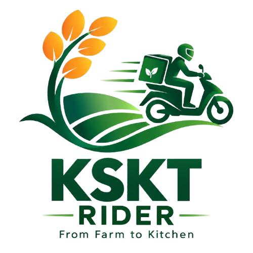

# KSKT Rider (RideTrack)

<p align="center">
  
</p>

<p align="center">
  <strong>From Farm to Kitchen (Kisaan Se Kitchen Tak)</strong><br />
  A high-performance Flutter mobile application for real-time delivery rider tracking, route recording, and trip management.
</p>

<p align="center">
  
  
  
  
</p>

---

## Table of Contents

- [Overview](#overview)
- [Key Features](#key-features)
- [Project Documentation](#project-documentation)
- [Tech Stack](#tech-stack)
- [Project Structure](#project-structure)
- [Quick Start](#quick-start)
- [License](#license)

---

## Overview

**KSKT Rider** powers the delivery logistics network for KSKT ("Kisaan Se Kitchen Tak"), ensuring fresh produce journeys seamlessly from farm gates straight to customer kitchens. The app provides delivery partners with accurate GPS tracking, map visualization, route logging, and offline data persistence.

---

## Key Features

- **Branded Splash & Smooth Onboarding**: Polished entry screen with automated location readiness checks.
- **Real-Time GPS Tracking**: Precise rider coordinate streaming with speed, elapsed time, and distance calculation.
- **Interactive Map**: Live route visualization, rider markers, and breadcrumb path recording.
- **Offline Trip Storage**: Local SQLite persistence guarantees no trip data is lost even with unstable connectivity.
- **Reverse Geocoding**: Real-time address resolution for stops and delivery locations.

---

## Project Documentation

Detailed documentation is available in the [`readme/`](file:///e:/project/ridetrack/readme/) directory:

- [**Getting Started & Setup Guide**](file:///e:/project/ridetrack/readme/GETTING_STARTED.md): Prerequisites, installation, environment setup, and platform permissions.
- [**Architecture & Design Pattern**](file:///e:/project/ridetrack/readme/ARCHITECTURE.md): Clean Architecture layers (Data, Domain, Presentation), BLoC pattern, and Dependency Injection.
- [**Features & Modules**](file:///e:/project/ridetrack/readme/FEATURES.md): Comprehensive functional breakdown of each module and capability.

---

## Tech Stack

| Technology | Purpose |
|---|---|
| **Flutter / Dart** | Cross-platform mobile framework |
| **flutter_bloc** | Predictable state management |
| **get_it** | Dependency injection / Service locator |
| **geolocator** | High-precision geolocation tracking |
| **geocoding** | Coordinate-to-address translation |
| **sqflite** | Local relational database for offline storage |
| **http** | REST API communication |

---

## Project Structure

```
ridetrack/
├── assets/
│   └── images/              # Logo, brand badges, and background patterns
├── readme/                  # Extended documentation (Guides, Architecture, Features)
│   ├── ARCHITECTURE.md
│   ├── FEATURES.md
│   └── GETTING_STARTED.md
├── lib/
│   ├── core/                # DI, Theme, Routes, Location & Geocoding Services
│   ├── features/            # Splash, Permission, Trip, and Settings modules
│   └── main.dart            # Application entry point
├── pubspec.yaml             # Dependencies and asset declarations
└── README.md                # Project landing documentation
```

---

## Quick Start

1. **Install dependencies**:
   ```bash
   flutter pub get
   ```

2. **Run the application**:
   ```bash
   flutter run
   ```

3. **Run analyzer**:
   ```bash
   flutter analyze
   ```
